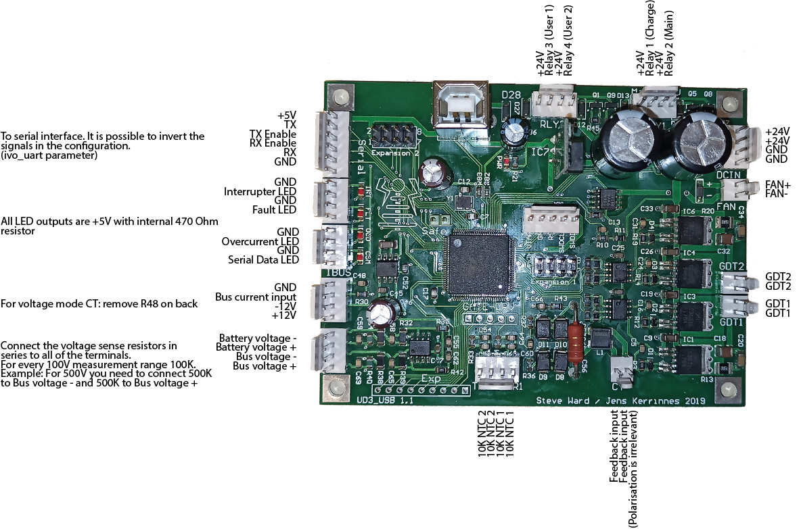
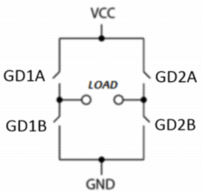
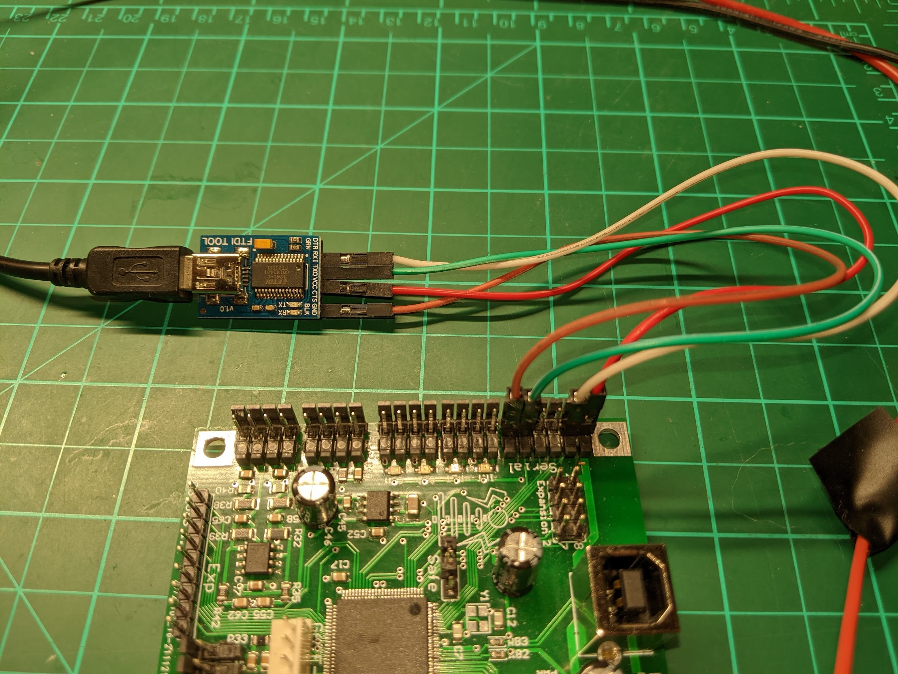

* **Power (DCIN)** 24V DC from power supply.  Max input is 30VDC.  The UD3 is programmed to disable the gate drive at ~22V.  When driving heavy loads, the UD3 may consume up to 2A at 24V.

* **Fan** Cooling fan / water pump (optional).  24V will be applied to these pins when thermistor 1 (THR1) reaches the temperature setpoint (parameter temp1_setpoint).  The on-board MOSFET driving this connector has been tested up to 3A.

* **GDT1, GDT2** Gate driver outputs to be connected to the external gate transformers.  The UD3 requires two separate gate drive transformers - one for the left side of the bridge (GDT1), and one for the right (GDT2) in order to implement pulse skipping.  The technique of putting all 4 GDT wires on a single core will not work.  The waveform on the two pins of GDT1 are the inverse of each other.  Similarly, the two pins of GD2 are the inverse of each other. 

* **Current Transformer (CT)** The input from the current transformer to provide feedback.  Polarization does not matter.  You need to adjust the turns ratio on the transformer to result in about 1.5A at absolute peak current.

* **THR1, THR2** Optional thermistors to determine temperature and perform various functions (enable fan, disable bridge on overtemperature, etc).  The set-points and function to perform are specified via command line parameters.  The thermistors are of type B57875S0103J002 (or similar).

* **Bus Voltage** These are the lower two pins of the unlabeled VSNS connector at the bottom of the left side.  This is an optional connection to the DC bus that feeds the bridge.  It is currently only used to implement precharge (inrush) functionality.  See the ps_scheme parameter for more details.  This connection requires two external series resistors (one for each pin).  The resistors need to sized to provide 100 kOhms for every 100V of bus voltage.  If your bus has 800V max on it, then these resistors should be 800 kOhms each.  If you change this from the default 500k, be sure to update the `r_bus` parameter.

* **Battery Voltage** These are the two pins above the Bus Voltage connection on the unlabeled VSNS connector at the bottom of the left side.  This is an optional connection and is only used to display the battery voltage for the 'status' command.  Like the bus voltage inputs, both of these pins need to be connected to external resistors, sized to provide 100 kOhms for every 100V.  If you change this from the default 500k, be sure to update the `r_bus` parameter.

   This was originally intended for use by a Tesla gun to monitor the battery voltage, but if you add an external rectifier you could measure AC mains here.  Do not connect AC directly to this connector though - positive voltage only is expected here.

* **IBUS** This is an optional connection to monitor the DC bus current.  If this connection is not provided the UD3 will not be able to limit the bus current.  This is designed to be connected to a closed loop hall-effect current sensor similar to a LEM LF 306-S.  The input (output of the sensor) expects 0 to 5V.  +- 12V is provided on the connector.  There is a 50 ohm burden resistor on board to handle most applications.  This sensor requires the DC bus to pass through it and will affect the layout of your bridge.  You need to ensure the wire is oriented correctly as it passes through the LEM.  If you get it backward, the UDB3 will always see a negative current and map it to 0.  For voltage-mode sensors (similar to ACS758) remove R48 on the back of the UD3.  See the ct2_type parameter for more details.

* **LED's** These optional connections are for external LED panel indicators to indicate Serial Data, Overcurrent, Fault, and Interrupter status. There are 470 ohm resistors in series with the LED outputs so external resistors are not required.  All LED outputs are 5V.

* **Serial** This is the primary interface to external controllers and supports RS232 or RS485.  This can be connected to a USB FTDI board, a custom serial interface, or the Fibernet add-on board.  For low power testing a wired connection is fine, but for full power use a fiber connection is recommended.  The TX_Enable and RX_Enable pins are not currently used.

   To connect your computer via an FTDI board, make the following connections: 

   |FTDI Board|UD3 Serial Connector|
   |----------|--------------------|
   |RXI|Tx|
   |TXO|Rx|
   |GND|GND|

   If you want to power the UD3 from the FTDI board you can connect the VCC of the FTDI board to the +5V pin on the UD3 Serial connector. 
   

   Once the hardware is connected, start a terminal emulation program on the computer (like Putty or Teslaterm).  Once connected to the UD3's CLI (command line interface) you can enter commands and parameters to control the operation.

   The default baud rate is 460800.
      
 * **USB** The USB connection uses a standard Type B connector.  This will also power the board at 5V for low power testing and configuration.  Note that the under voltage  fault will be triggered at this low voltage.  By running a terminal emulation program on the computer (like Putty) you can connect to the UD3's CLI (command line interface) where you can enter commands and parameters to control the operation.

* **RLY1, RLY2** These two connectors at the top of the PCB support 4 relays in total: relay 1 and 2 are on the RLY1 connector, and relay 3 and 4 are on the RLY2 connector.  The relay connections use on-board MOSFET's to drive a 24V DC coil at 0.5A or less.  All 4 relays are optional, and are used for the following functions: 
   * Relay 1 is the bus relay.  Connect the bus through the relay contacts to allow it to be turned on/off with the bon and boff commands.
   * Relay 2 is the charge end relay.  This is energized when the precharge completes and is designed to bypass inrush resistors.  For more details, see the ps_scheme and charge_delay parameters.
   * Relay 3 is available for whatever you want.  This is controlled by the `relay` command.
   * Relay 4 is available for whatever you want.  This is controlled by the `relay` command. 
    

* **Safe Jumper** Short these two pins to enable safe mode.  In safe mode the EEPROM will NOT be read during startup.  Use this to allow the bootup if an invalid configuration was saved to the EEPROM (like if MIN is enabled on a VT100 terminal and you need to disable it).  Safe mode is indicated by flashing the 4 LED's in a unique bouncing pattern during boot.  Normally the jumper should just be connected to 1 pin only.

* **PRG** Connection for a PSoC KitProg programmer board such as comes with the CY8CKIT-059 prototyping kit.  This is used to program/debug the firmware on the UD3 usually via the free PSoC Programmer or PSoC Creator software.
TODO!

* **Gate-DRV** The gate drive TTL signals (0-5V).  These allow the gate drive signals to be easily scoped for debugging.

* **Expansion 1** 
   |Connector Pin|Schematic Signal|MCU Pin|Assignment|
   |-------------|----------------|-------|----------|
   |1||None|+5V|
   |2||None|Gnd|
   |3|TP1|18|SDA_1|
   |4|TP2|19|Unassigned|
   |5|TP3|17|SCL_1|
   |6|TP4|4|Unassigned|
   |7|TP5|16|ws2812 (LED light display)|
   |8|TP6|5|int1 (interrupter output)|

* **Expansion 2**
   |Connector Pin|Schematic Signal|MCU Pin|Assignment|
   |-------------|----------------|-------|----------|
   |1||None|+5V|
   |2||None|Gnd|
   |3|E6|70|Unassigned|
   |4|E5|69|Unassigned|
   |5|E4|68|Unassigned|
   |6|E3|67|Ext_Interrupter|
   |7|E2|52|Unassigned|
   |8|E1|51|DEBUG_DA|

* **Exp** None of the pins on this connector are currently assigned.