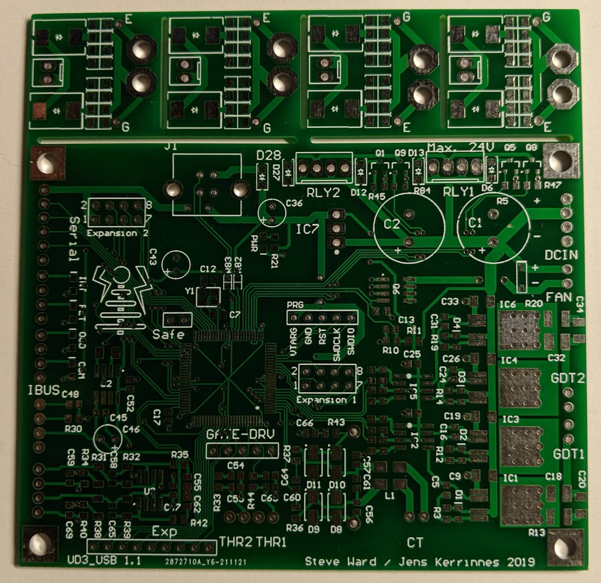

The UD3 and the 4 break-away gate drive PCBs

## Notes
* There are 4 small gate drive boards attached to the main UD3 PCB with break-away tabs in the gerber files.  These are not part of the UD3B and are not needed for its operation.  Either edit them out of the board files or cut them off after receiving the PCB.

* I used JLCPCB to manufacture the PCB's.  Cost was $2 + $20 shipping for 5 boards.  They turned out great.

* With the current chip shortage it can be difficult to find some of the components.  In general there should be no problem substituting components of equal or better specs.  Several alternate components are listed in the BOM that will work.

* One component to be careful with are the 4 diodes on the CT input circuit (D8, D9, D10, D11). These are used to rectify the CT pulses and must be of the ultra fast recovery type.  Using standard recovery diodes will result in assymetric waveforms and inconsistent pulses.

* The one component you cannot substitute is the PSoC chip itself.  These are currently very difficult to find.  One solution is to find a SparkFun FreeSoC2 board and desolder the CY8C5888AXI-LP032 chip with a hot air rework station.  This is an 80Mhz part and the UDB3 calls for a 67Mhz part so it works fine.

* Do not use an external crystal for Y1 (just leave it off the PCB).  The internal PSoC oscillator is good enough.

* There are several unlabeled components on the PCB:
  * C6: between IC5 and IC2
  * C49: above U2
  * D7: left of DCIN (the cathode "bar" is oriented towards the top on the + pad)
  * IND1: left connector for INT and FLT
  * IND2: left connector for OCD and COM
  * LED3: the INT led
  * LED4: the FLT led
  * LED5: the OCD led
  * LED6: the COM led
  * MCU1: the big PSoC chip above "GATE-DRV"
  * R4, R7, R8, R9: left of IC2
  * R15, R16, R17, R18: left of IC5
  * R46: below Q6
  * VSNS: lower left 4-pin connector for battery/bus voltage 
