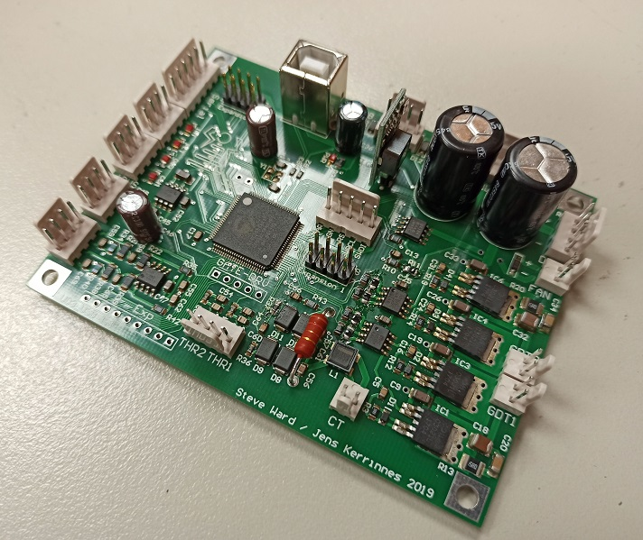

The UD3 is a Tesla coil driver board for controlling a DRSSTC or QCW. The interrupter is embedded in the UD3 (Classic Mode / MIDI / SID(C64) / QCW Ramp).  The UD3 was originally developed by Steve Ward.

## Features
* Embedded interrupter with MIDI and SID audio modulation
* Primary resonator fres measurement (frequency sweep)
* Primary peak current measurement over feedback CT
* Pulse skipping
* Alarm/Event system for fault tracing
* System fault interlocks for undervoltage/temperature/watchdog
* Bus current measurement (current or voltage mode CT)
* Controls up to 4 relays to handle inrush current and other things
* Can control an external light display for showing selected parameters
* It runs FreeRTOS, making it easy to add new functionality
* Commandline over serial interface
* Multi user commandline over MIN-Protocol
* Dual voltage measurement (differential)
* Support for Teslaterm and UD3-node
* Telemetry over serial
* Bootloader with serial/usb support (firmware update with Teslaterm)

## Useful links
* [Altium project for UD3B](https://github.com/Netzpfuscher/UD3_PCB)
* [Schematic](files/ud3bSchematic.pdf)
* [BOM](files/ud3bBOM.xlsx)
* [Gerber files](files/ud3bGerbers.zip)
* [Teslaterm](https://github.com/malte0811/Teslaterm) (Enhanced terminal emulator for interfacing with the UD3)
* [Fibernet](https://github.com/TMaxElectronics/UD3_Fibernet) (Add-on board for an optical fiber interface)
* [Fibernet firmware](https://github.com/TMaxElectronics/UD3-Fibernet-Firmware)

## Getting started
1. See [Build Notes](Building-the-UD3) for tips on building the UD3.
2. [Flash](Flashing-the-firmware) the firmware
3. See the [Testing](Testing) page for some things to check to verify operation.
4. [Connect](Board-Connections) the UD3 to your coil
5. See the reference pages for a list of available [commands](Commands) and [parameters](Parameters).
6. Make sparks (the good kind)

## For the Impatient
After flashing connect to the USB-Port and connect to the virtual serial port with a VT100 terminal like putty.

Configure your serial connection. The default baudrate is 460800. It is sufficient.

If you want to connect to Teslaterm or UD3-Node you need to enable MIN:  
`set min_enable 1`

You need to have a feedback transformer which results in round about 1,5A at absolute peak current.
Setup your feedback current transformer (CT1) example: 1:1000  
`set ct1_ratio 1000`

Setup your DC-Bus current transformer:  
`set ct2_ratio 1000`

Enter the maximum current for transient mode (DRSSTC):  
`set max_tr_current 600` 

Enter the minimum current for transient mode only used for MIDI modulation (DRSSTC):  
`set min_tr_current 100`

Enter the maximum current for qcw mode (QCW):  
`set max_tr_current 300`

Enter the maximum pulsewidth and repetition rate (us/Hz):  
`set max_tr_pw 400`  
`set max_tr_prf 800`  

Enter the lead time (ns) around 500ns for small bricks and around 1000 for big bricks:  
`set lead_time 1000` (Test)

Make a autotune, connect everyting and give your coil a little bit bus voltage (around 40V-60V):  
`set tune_start 30` (kHz for sweep start frequency)  
`set tune_stop 100` (kHz for sweep stop frequency)  
`bus on`  
`tune prim`  

The coil sweeps through the given range and finds the resonant frequency. This frequency needs to
be set in the start oscillator:
`set start_freq 54.4` (in kHz)

Save everyting in the EEPROM:  
`eeprom save`

If you have enabled MIN, you need to restart your coil [reset]. You can test everything with the 
transient mode:  
`set watchdog 0` (to disable watchdog)  
`kill reset` (to clear all faults)  
`tr start`  
`set pw 30` (for 30us ontime)  
`set pwd 2000` (for 2000us period)  
`tr stop` (to disable transient mode)  