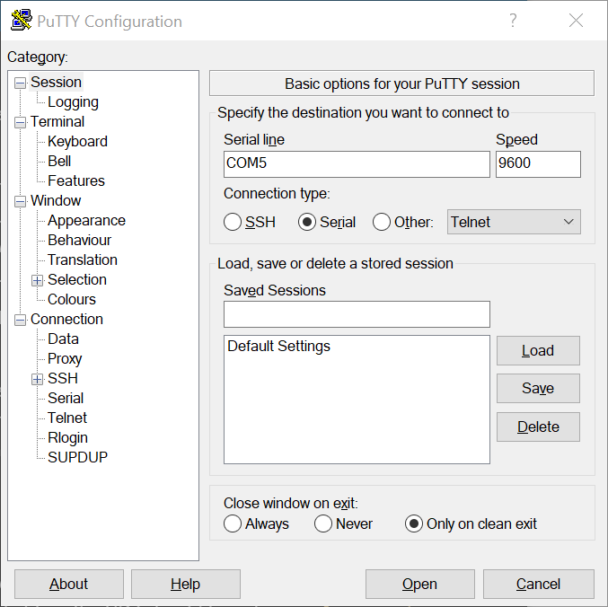
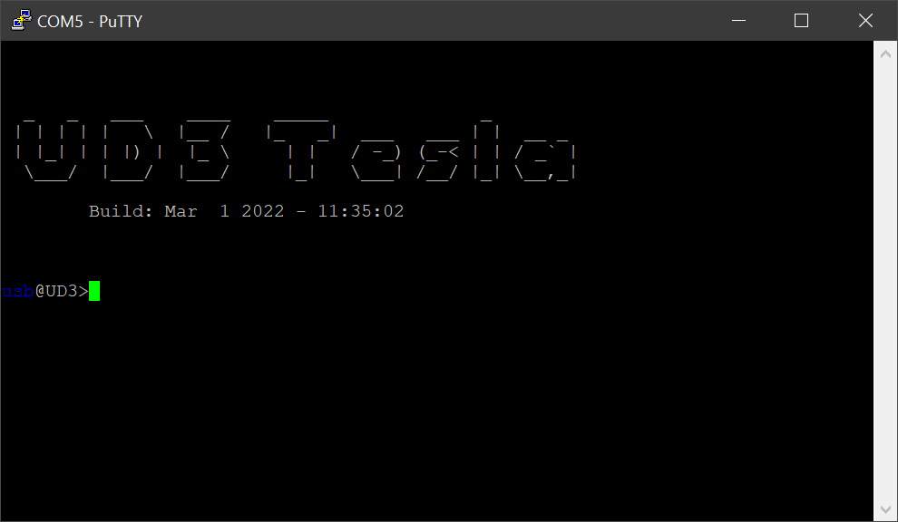
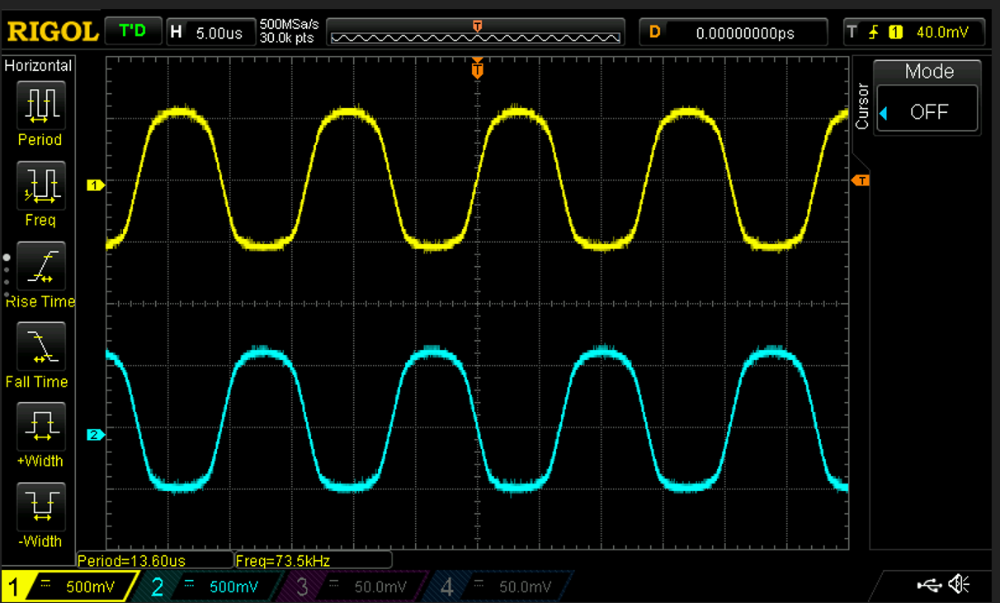

## Initial Testing
1. When first powering up the UD3 it is a good idea to use a current limiting power supply to limit the current to approx 100mA at 24V DC to the DCIN connector.  The UD3 pulls 28mA at 24V at idle.  None of the components should get warm.

2. Connect your computer to the UD3 via the USB connector.  There is no need to apply 24V to DCIN at this time - the UD3 will run fine on 5V from the USB connection.  You will need to run a terminal emulator on your computer like Putty or Teslaterm.  For Putty, click the "Serial" connection type and enter the correct COM port for the connected UD3.  You can find this on Windows by looking in the "Ports (COM & LPT)" category in Device Manager.  The baud rate is irrelevant with a USB connection so go ahead and click "Open". 
   

   When you connect successfully you will be presented with the UD3 CLI screen:
   

   At this point you should be able to use the CLI.  For example, enter the `get` command to obtain a list of the current parameters.

3. When connecting to the UD3 through a normal VT100 terminal (not Teslaterm) you will need to disable the watchdog timer.  A normal VT100 terminal like Putty doesn't know to send the keep-alive messages and the UD3 watchdog timer will cause a fault state.  To disable the watchdog:

   1. `set watchdog 0` (to disable watchdog)
   2. `kill reset` (to clear all faults)  

4. Check that UVLO is working by applying 24V to DCIN using an adjustable DC power supply and slowly turning down the voltage.  When the input voltage reaches approximately 22V the red FLT light on the UD3 should turn on.  Typing `alarms get` should show "DRIVER: Undervoltage".  Increasing the input voltage back above 22V should turn off the red FLT light.

## Additional Notes
* If you power the board via the USB or Serial connection and don't apply 24V to VCIN then UVLO will trigger and put the system into a fault state.  This will prevent the GDT's from functioning but you can still use the CLI.

* It is a good idea to check the gate drive signals before connecting the UD3 to a bridge.  You can scope the logic levels of the GDT's via the GATE-DRV connector just below the MPU.  These are 0-5V TTL signals.  GD1A and GD1B should be the inverse of each other.  GD2A and GD2B should also be the inverse of each other.  In width of the pulses is proportional to the pulse width and any modulation in effect.

* To enable the gate drive outputs for scoping:

  1. Make sure the fault light is off.  You can use `alarms get` to see what is causing the fault.  Common causes are watchdog and undervoltage (is 24V applied to DCIN?).  Once the problem has been corrected, clear the fault state with `kill reset`.
  2. `set pw 30` (for 30us ontime) 
  3. `tr start`  (start transient (DRSSTC) mode)  

* If no feedback is detected on the CT connector the UD3 will use an internal oscillator running at `start_freq`, which can be adjusted via the `set` command.  For testing, the CT input can be connected to a signal generator.  Care must be taken here to ensure the CT inputs are floating (not connected to ground).  Some signal generators have this as a feature, or you can plug the signal generator power cord into an isolation transformer.  Yet another method is to pass the signal generator output through a 1:1 transformer (like a GDT) before connecting to CT.  A POS584NL gate drive transformer works here.  This particular transformer will saturate (and the output will be distorted and attenuated) if the frequency is too low, but it worked fine at around 63Khz.

CT signals (ZCDA and ZCDB) using a signal generator sine wave at 73kHz.

* A speaker can be connected to TP6 (Expansion 1 connector, pin 8) to test the MIDI output.  Be sure to use an amplified speaker - it is possible to burn out the PSoC when doing this without an amplifier.
